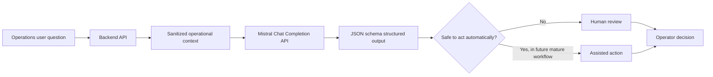

# Mistral Enterprise Workflow Demo

This is a small, public-safe demo of an enterprise LLM workflow pattern:

1. Take a natural-language operations question.
2. Attach only the relevant operational context.
3. Ask the Mistral Chat Completion API for a structured JSON answer.
4. Keep the result human-reviewable before any real business action.

The sample data is synthetic. It is inspired by common enterprise operations patterns, but it does not contain company, client, customer, or production data.

## Why this exists

Many enterprise AI demos stop at "call a model and print text." In real systems, the difficult part is usually around the model:

- Which data is the model allowed to see?
- How do we keep the response structured?
- What happens when the model lacks enough context?
- Where should human review stay in the workflow?
- How can another engineer reuse the pattern safely?

This repo is intentionally small so the pattern is easy to inspect.

## Workflow



## What the demo shows

- A structured output schema for an operations assistant.
- A prompt boundary that tells the model not to invent records.
- A live API path using `MISTRAL_API_KEY`.
- An offline path so the repo can be reviewed without credentials.
- A simple browser UI for offline/live mode.
- Startup logs that confirm whether live Mistral access is configured and reachable.
- Tests for the request shape, CSV loading, `.env` loading, and response parsing.

## Project structure

```text
.
|-- examples/
|   |-- sample-operations-context.csv
|   `-- sample-operations-context.json
|-- src/
|   |-- data-store.js
|   |-- env.js
|   |-- index.js
|   |-- web-server.js
|   |-- workflow.js
|   `-- web/
|       |-- app.js
|       |-- index.html
|       `-- styles.css
|-- test/
|   |-- data-store.test.js
|   |-- env.test.js
|   `-- workflow.test.js
|-- .env.example
|-- package.json
`-- README.md
```

## Run offline

No dependencies are required beyond Node.js 20+.

```bash
npm test
npm run demo:offline
```

This reads sample records from `examples/sample-operations-context.csv`.

You can also pass a custom question:

```bash
npm run demo:offline -- "Which tours need a Chinese-speaking guide?"
```

## Run the simple UI

```bash
npm run demo:web
```

The server prefers port `8787`. If that port is busy, it automatically picks the next available port and prints it.

The command loads `.env` automatically, so `MISTRAL_API_KEY` and `MISTRAL_MODEL` are available in `Live` mode.

On startup, the server prints safe diagnostics:

```text
[startup] Loaded .env file: yes
[startup] MISTRAL_API_KEY present: yes
[startup] MISTRAL_MODEL: mistral-small-latest
[startup] UI server ready at http://localhost:8787
[startup] Mistral live mode: connected successfully. model=mistral-small-latest; confidence=low
```

The API key itself is never printed. The startup check makes one small live Mistral request to confirm the key, network, and model work.

To skip the startup check:

```bash
MISTRAL_STARTUP_CHECK=false npm run demo:web
```

PowerShell:

```powershell
$env:MISTRAL_STARTUP_CHECK = "false"
npm run demo:web
```

- `Offline` mode: uses CSV records and local deterministic logic.
- `Live` mode: uses CSV records plus Mistral API structured output.

## Run against Mistral

Create an API key in Mistral, then create a local `.env` file:

```bash
cp .env.example .env
```

Edit `.env`:

```bash
MISTRAL_API_KEY=replace_me
MISTRAL_MODEL=mistral-small-latest
```

Then run:

```bash
npm run demo:live -- "Which tours need a Chinese-speaking guide?"
```

PowerShell:

```powershell
Copy-Item .env.example .env
# Edit .env and paste your key
npm run demo:live -- "Which tours need a Chinese-speaking guide?"
```

You can also set environment variables directly instead of using `.env`.

## Notes on the Mistral API

This demo uses the Chat Completion endpoint and requests `response_format.type = "json_schema"` so the model returns JSON that follows the provided schema.

Useful official docs:

- Chat Completion API: https://docs.mistral.ai/api
- Chat completions guide: https://docs.mistral.ai/studio-api/conversations/chat-completion
- Custom structured outputs: https://docs.mistral.ai/studio-api/conversations/structured-output/custom

## Design choices

### Structured output over free-form text

Free-form answers are easy to demo, but harder to integrate. This demo asks for:

- `answer`
- `confidence`
- `matchedRecords`
- `recommendedActions`
- `needsHumanReview`
- `missingInformation`

That shape is easier for a backend service, UI, or review workflow to consume.

### Human review by default

The sample keeps `needsHumanReview` as a first-class field. In real enterprise workflows, this is useful while the team is still validating model behavior, data quality, and operational risk.

### Public-safe context

The example uses synthetic tour, guide, and logistics-like records. The pattern matters more than the domain.

## What I would add next

- A real API route using Fastify, Hono, or NestJS.
- Contract tests for the schema.
- More evaluation cases for "not enough information" and "ambiguous question."
- Logging/observability around latency, confidence, and fallback rate.
- Authentication and per-user audit logs for a production version.

## License

MIT
